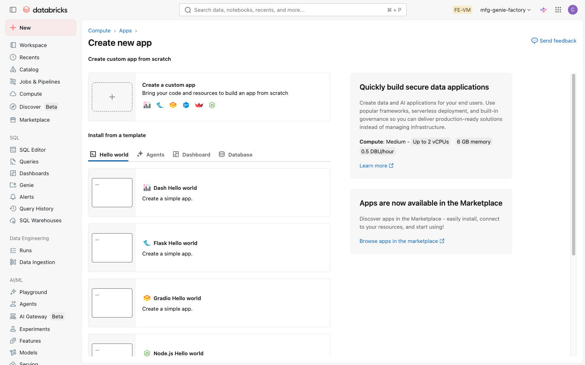
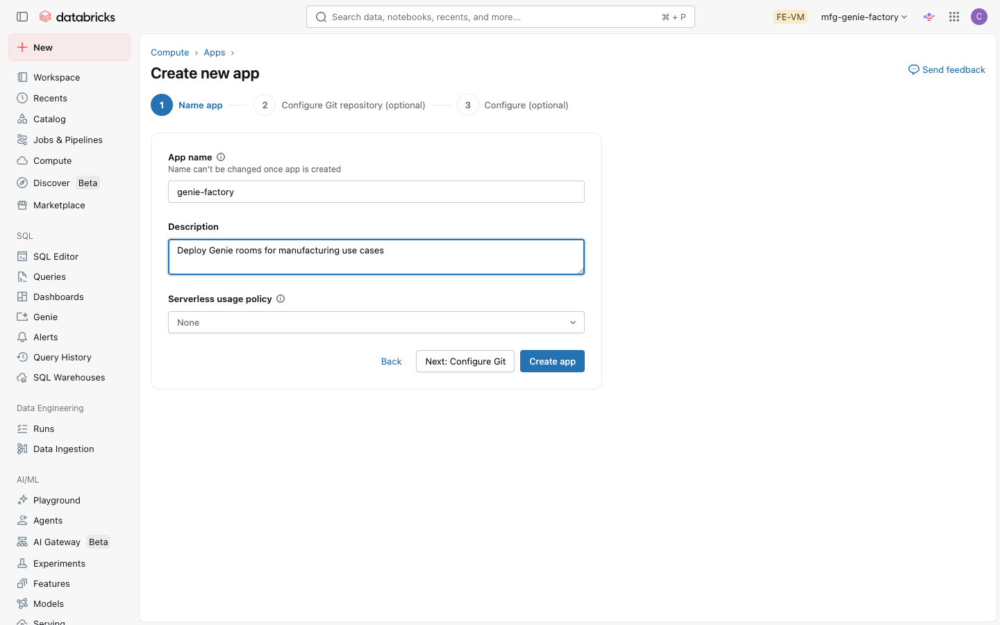
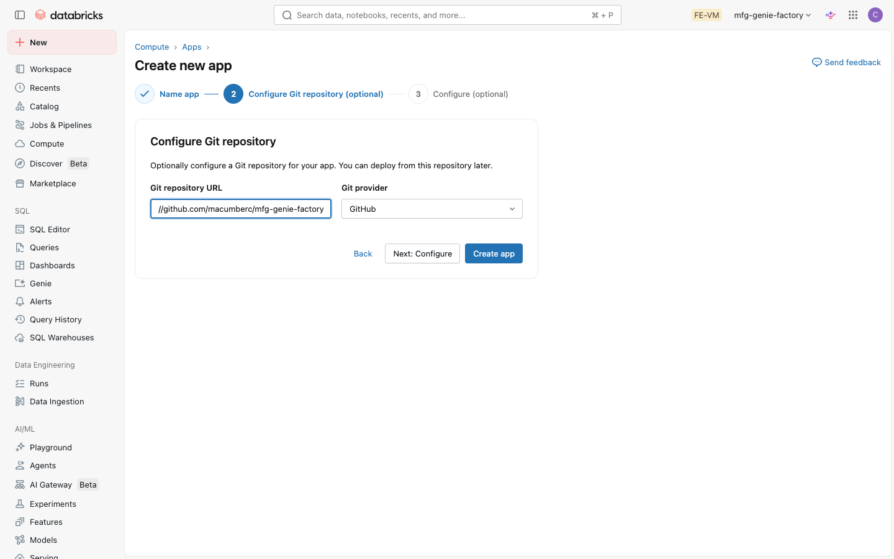
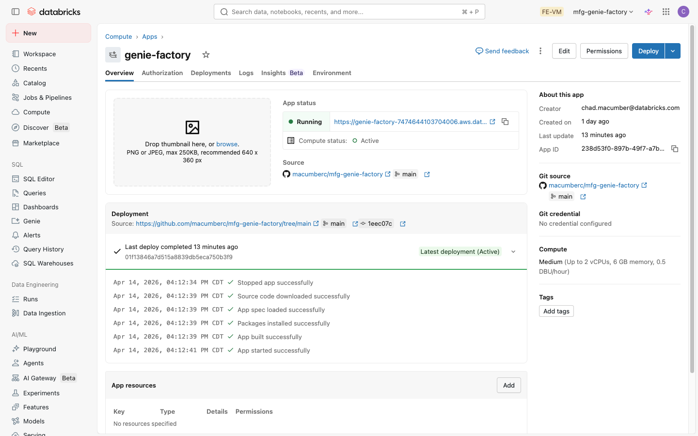
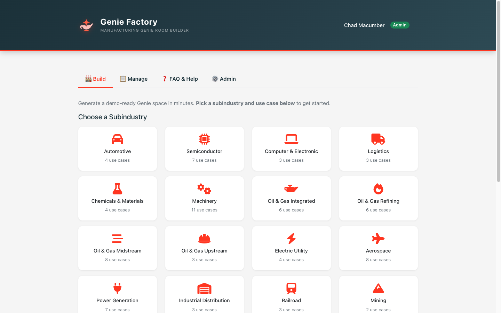
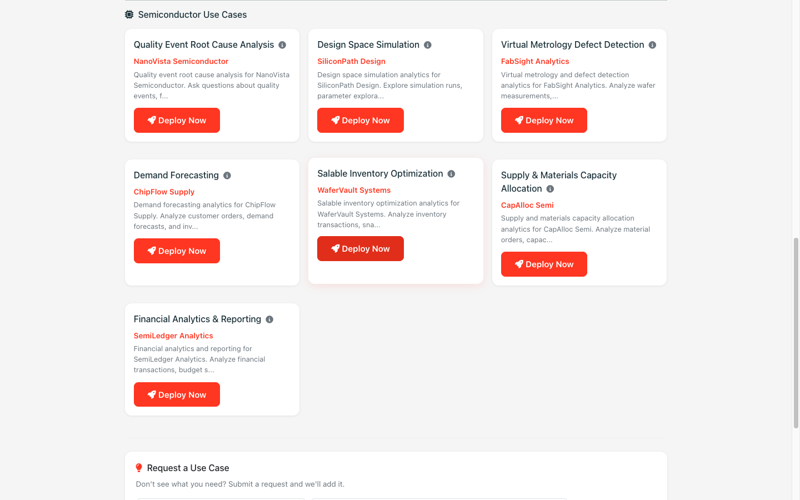

<p align="center">
  
</p>

<h1 align="center">Genie Factory for Manufacturing</h1>

<p align="center">
  Deploy a fully configured <a href="https://docs.databricks.com/en/genie/index.html">Databricks Genie</a> room for any manufacturing use case.<br>
  88 pre-built use cases across 18 subindustries. Pick and deploy — no configuration required.
</p>

---

## What It Does

Genie Factory deploys a complete, ready-to-use Genie room in ~2 minutes. Each deployment creates:

- **Unity Catalog schema** scoped to the deploying user
- **3 Delta tables** with realistic synthetic data (~8,000 rows), column comments, and descriptions
- **2 metric views** with governed measures and dimensions
- **Genie space** pre-configured with sample questions, example SQLs, and benchmarks

> **Requirement:** A Databricks workspace with Unity Catalog enabled and at least one SQL warehouse.

---

## Deploy the App

### Step 1: Create the app in Databricks

In your Databricks workspace, go to **Compute** > **Apps** and click **Create app**.

<p align="center">
  
</p>

Select **Create a custom app**, then enter a name (e.g. `genie-factory`) and click **Next: Configure Git**.

<p align="center">
  
</p>

### Step 2: Connect to GitHub

Paste the GitHub repo URL and select **GitHub** as the provider, then click **Create app**.

```
https://github.com/macumberc/mfg-genie-factory
```

<p align="center">
  
</p>

### Step 3: Deploy

Click **Deploy** from the app detail page. Databricks will pull the code from GitHub and start the app.

<p align="center">
  
</p>

The first deploy takes ~2 minutes. When the status shows **Running**, click the app URL to open it.

> **Note:** The app automatically grants its Service Principal the permissions it needs on first startup. If deployments fail with permission errors, see [Troubleshooting](#troubleshooting) below.

---

## Using the App

1. Open the app and go to the **Build** tab
2. Pick a manufacturing subindustry (e.g. Semiconductor, Aerospace, Oil & Gas)

<p align="center">
  
</p>

3. Click a use case card to deploy

<p align="center">
  
</p>

4. The app auto-selects a running SQL warehouse, loads the pre-built spec, and deploys everything in ~2 minutes
5. When complete, click the Genie space link to open your new room

---

## Available Use Cases

88 ready-to-deploy use cases across 18 manufacturing subindustries:

| Subindustry | Use Cases |
|:---|:---|
| ✈️ **Aerospace** | Predictive Maintenance & Asset Health, Design Space Simulation for Fuel Efficiency, Quality Event Root Cause Analysis, Demand Forecasting, Supply & Materials Planning, Product Traceability Anti-counterfeit, Working Capital & Cash Flow Optimization, Financial Analytics & Reporting |
| 🚗 **Automotive** | Vehicle Recall Root Cause Analysis, Vehicle Health & Maintenance Report, Product Feature Usage Analytics, Design Space Simulation for Safety |
| 🧪 **Chemicals & Materials** | Demand Forecasting, Autonomous Lab Experiments, Quality Event Root Cause Analysis, Product & Process Traceability |
| 💻 **Computer & Electronic** | Visual Defect Detection, Predictive Maintenance Troubleshoot, Design Space Simulation System on Chip |
| 🏗️ **Construction & Engineering** | Engineering Bid Creation, Production and Project Completion Monitoring |
| ⚡ **Electric Utility** | Transformer Asset Health, Grid Management & Energy Mix, Demand Forecasting, Outage Response |
| 🍔 **Food & Beverage** | Quality Event Root Cause Analysis, Product & Process Traceability Recall, Inventory Optimization, Scenario Planning & Business Simulation |
| 📦 **Industrial Distribution** | Demand Forecasting, Inventory Optimization, Working Capital & Cash Flow Optimization |
| 🚚 **Logistics** | Route Planning, Fleet Planning and Optimization, Load Demand Forecasting |
| ⚙️ **Machinery** | Asset Health, Machining Process Defect Detection, Production Monitoring, Field Service Assistant, Quality Event Root Cause Analysis, Demand Forecasting, Spare Part Inventory Optimization, Manufacturing Resource Planning, Working Capital & Cash Flow Optimization, Financial Analytics & Reporting, Spend Intelligence |
| ⛏️ **Mining** | Haul Vehicle Asset Health, Production Monitoring & Control Center |
| 🛢️ **Oil & Gas Integrated** | Predictive Maintenance & Asset Health, Production Monitoring & Control Center, Scenario Planning & Business Simulation, Capital Investment Simulation, Financial Analytics & Reporting, Working Capital & Cash Flow Optimization |
| 🔗 **Oil & Gas Midstream** | Logistics Optimization, Regulation & Compliance, Scenario Planning & Business Simulation, Energy Trading, Financial Analytics & Reporting, Automated Reporting of Carbon Intensity, Working Capital & Cash Flow Optimization, Spend Intelligence |
| 🏭 **Oil & Gas Refining** | Predictive Maintenance & Asset Health, Quality Event Root Cause Analysis, Energy Use Monitoring Heat, Production Monitoring, Financial Analytics & Reporting, Working Capital & Cash Flow Optimization |
| 🛢️ **Oil & Gas Upstream** | Predictive Maintenance & Asset Health, Reservoir Management, Well Production Monitoring & Flow |
| 🔋 **Power Generation** | Grid Management & Energy Mix, Outage Response, Nuclear Safety, Hydro Optimization, Solar Optimization Behind the Meter, Wind Optimization, Financial Analytics & Reporting |
| 🚂 **Railroad** | Route Planning, Predictive Maintenance & Asset Health, Freight Demand Forecasting |
| 🔬 **Semiconductor** | Quality Event Root Cause Analysis, Design Space Simulation, Virtual Metrology Defect Detection, Demand Forecasting, Salable Inventory Optimization, Supply & Materials Capacity Allocation, Financial Analytics & Reporting |

---

## Troubleshooting

| Problem | Fix |
|:--------|:----|
| Deploy fails with permission errors | The app's Service Principal may need manual grants. Clone the repo and run `./scripts/deploy_app.sh --profile <your-cli-profile>` to grant catalog, warehouse, and workspace permissions. Safe to re-run. |
| Genie space creation fails | The SP needs `CAN_MANAGE` on SQL warehouses **and** on the `/Users` workspace directory. Re-run the deploy script after the app exists. |
| "More than one authorization method" error | The app runtime sets `DATABRICKS_TOKEN` in the environment. The app code handles this — don't set additional auth env vars. |
| Tables fail with permission error on redeploy | When a schema was previously transferred to a user, the SP needs re-granting. Re-run the deploy script. |
| No SQL warehouse found | Ensure at least one SQL Pro or Serverless warehouse exists and is running on the workspace. |
